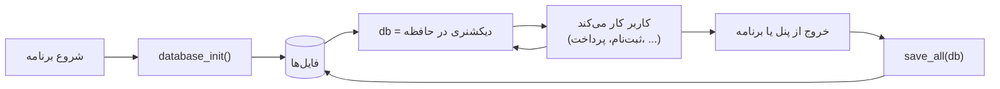

## نمای کلی برنامه

```mermaid
flowchart TD
    A([شروع: python main.py]) --> B["database_init()<br/>خواندن اطلاعات از فایل‌ها"]
    B --> C{"users.json<br/>وجود دارد؟"}
    C -- "نه (اولین اجرا)" --> D["seed_data()<br/>ساخت داده‌ی نمونه"]
    D --> E["save_all()<br/>ذخیره در فایل‌ها"]
    E --> F
    C -- "بله" --> G["خواندن همه‌ی فایل‌های JSON و TXT"]
    G --> F["منوی اصلی"]

    F --> F1["1. Admin login"]
    F --> F2["2. Coach login"]
    F --> F3["3. Member login"]
    F --> F4["4. Exit"]

    F1 --> L["login_flow(role)"]
    F2 --> L
    F3 --> L

    L --> M{"ورود موفق؟"}
    M -- "نه" --> N{"Try again<br/>یا Back؟"}
    N -- "Try again" --> L
    N -- "Back" --> F
    M -- "بله" --> P{"نقش کاربر"}
    P -- "admin" --> AP["admin_panel"]
    P -- "coach" --> CP["coach_panel"]
    P -- "member" --> MP["member_panel"]
    AP --> F
    CP --> F
    MP --> F

    F4 --> S["save_all()<br/>ذخیره‌ی نهایی"]
    S --> Z([پایان: Goodbye!])
```

## مسیر ذخیره‌ی اطلاعات

```mermaid
flowchart LR
    A["شروع برنامه"] --> B["database_init()"]
    B --> C[("فایل‌ها")]
    C --> D["db = دیکشنری در حافظه"]
    D --> E["کاربر کار می‌کند<br/>(ثبت‌نام، پرداخت، ...)"]
    E --> D
    E --> F["خروج از پنل یا برنامه"]
    F --> G["save_all(db)"]
    G --> C
```
